<div align="center">


<br>

# Fred Sneyder Castillo Apolinar

### Cybersecurity Student · Infrastructure · Security Engineering · Offensive Security

[](https://www.linkedin.com/in/fredcastillo11/)
[](https://www.youtube.com/@sneydercastillo6757)
[](https://github.com/fredcastillo)

</div>

---

## `> whoami`


Cybersecurity student at **ITLA** building a practical foundation across **networking, systems administration, infrastructure, cloud and security**.

My work is centered on controlled technical environments where I can:

- build systems and networks;
- harden infrastructure;
- test attack techniques safely;
- inspect evidence and security events;
- troubleshoot failures;
- document what worked, what failed, and why.

I currently hold the **ISC2 Certified in Cybersecurity (CC)** credential and I am building toward **Security Engineering** with a long-term specialization in **Offensive Security / Red Team**.

<br clear="right"/>

---

## `> featured_projects`

<table>
<tr>
<td width="50%" valign="top">

### <sub></sub> Windows Server 2025 Security Lab

Enterprise-style Windows security laboratory focused on:

- Active Directory Domain Services
- Group Policy
- Windows auditing
- WSUS
- PKI / Certificate Services
- Nessus vulnerability assessment
- Vulnerability remediation
- Microsoft LAPS
- Least privilege

**Shows:** Windows Security · AD · IAM · Vulnerability Management · Infrastructure Security

[**OPEN REPOSITORY →**](https://github.com/fredcastillo/windows-server-2025-security-lab)

</td>
<td width="50%" valign="top">

### <sub></sub> Cybersecurity Labs

Controlled cybersecurity labs covering areas such as:

- wireless security
- WPA/WPA2 testing
- dictionary attacks
- USB HID attack techniques
- Linux security
- defensive analysis

**Shows:** Offensive Security · Linux · Wireless Security · Security Research

[**OPEN REPOSITORY →**](https://github.com/fredcastillo/cybersecurity-labs)

</td>
</tr>

<tr>
<td width="50%" valign="top">

### <sub></sub> Digispark HID Attack & Defense PoC

Security research project exploring USB HID / BadUSB-style techniques in a controlled Windows environment.

Focus areas:

- HID injection
- PowerShell execution
- endpoint-security impact
- UAC behavior
- detection opportunities
- defensive controls

**Shows:** Red Team Fundamentals · Windows Security · PowerShell · Defensive Thinking

[**OPEN REPOSITORY →**](https://github.com/fredcastillo/Digispark-HID-Attack-Defense-PoC)

</td>
<td width="50%" valign="top">

### <sub></sub> Networking Labs

Hands-on networking environments focused on infrastructure and troubleshooting.

Current work includes:

- OSPF
- centralized DHCP
- WAN connectivity
- DHCP relay
- routing verification
- troubleshooting

**Shows:** Networking · Cisco · OSPF · DHCP · Infrastructure

[**OPEN REPOSITORY →**](https://github.com/fredcastillo/networking-labs)

</td>
</tr>
</table>

---

## `> security_mindset`

<div align="center">

</div>

I want to understand the full lifecycle, not only individual tools:

```text
BUILD -> CONFIGURE -> HARDEN -> TEST
ATTACK -> OBSERVE -> DETECT -> REMEDIATE -> AUTOMATE
```

---

## `> technical_stack`
## `> technical_stack`

<p align="center">


</p>

<table align="center">
<tr>
<td width="150" align="right" valign="middle">

### `01`

**SECURITY**

</td>

<td valign="middle">


<br>

<sub>Wazuh · Wireshark · Nessus · Active Directory · SIEM · IAM · Hardening</sub>

</td>
</tr>

<tr>
<td width="150" align="right" valign="middle">

### `02`

**INFRA**

</td>

<td valign="middle">


<br>

<sub>Windows Server · AD DS · GPO · Containers · Virtualization</sub>

</td>
</tr>

<tr>
<td width="150" align="right" valign="middle">

### `03`

**NETWORKING**

</td>

<td valign="middle">


<br>

<sub>Routing · Switching · OSPF · VLANs · ACLs · VPN · IPsec</sub>

</td>
</tr>

<tr>
<td width="150" align="right" valign="middle">

### `04`

**AUTOMATION**

</td>

<td valign="middle">


<br>

<sub>Scripting · Automation · Infrastructure as Code · Cloud</sub>

</td>
</tr>

<tr>
<td width="150" align="right" valign="middle">

### `05`

**OFFENSIVE**

</td>

<td valign="middle">


<br>

<sub>Reconnaissance · Enumeration · AD Security · PrivEsc · Web Security · Pentesting</sub>

</td>
</tr>
</table>

<p align="center">


</p>

---

## `> certifications`

### Cybersecurity
- **ISC2 Certified in Cybersecurity (CC)**
- Google Cybersecurity Professional Certificate
- Certiplus CCA Cybersecurity Certification Associate
- INDOTEL Cybersecurity Training

### Cloud
- **Oracle Cloud Infrastructure 2025 Certified Foundations Associate**
- Microsoft Azure / Cloud training

### Networking & Systems
- Cisco Networking / CCNA training
- IT Essentials
- Linux CentOS Stream training

> Certifications support the context. The portfolio remains focused on practical work, labs and technical evidence.

---

## `> current_growth`

```yaml
security_engineering:
  - identity_security
  - infrastructure_hardening
  - vulnerability_management
  - detection_and_monitoring
  - cloud_security
  - automation

offensive_security:
  - reconnaissance
  - enumeration
  - windows_privilege_escalation
  - linux_privilege_escalation
  - active_directory_security
  - web_security
  - penetration_testing
```

These are **development areas and career targets**, not claims of professional-level mastery.

---

## `> security_focus`

<div align="center">



  <a href="https://github.com/fredcastillo?tab=overview"></a>
  
</div>

---

## `> technical_communication`

I also use **YouTube** to document technical work, labs, troubleshooting and demonstrations.

[](https://www.youtube.com/@sneydercastillo6757)

This public documentation supports skills such as:

`Troubleshooting` · `Technical Documentation` · `Lab Design` · `Communication` · `Security Analysis`

---

## `> languages`

```text
Spanish  ████████████████████  Native
English  █████████████████░░░  C1 Advanced
```

**MESCYT English Immersion Advanced Course**

---

## `> contact`

<div align="center">

[](https://www.linkedin.com/in/fredcastillo11/)
[](https://github.com/fredcastillo)
[](https://www.youtube.com/@sneydercastillo6757)

### Understand the system. Secure the system. Test the system.

`Networking` · `Systems` · `Infrastructure` · `Cybersecurity` · `Offensive Security`

</div>
